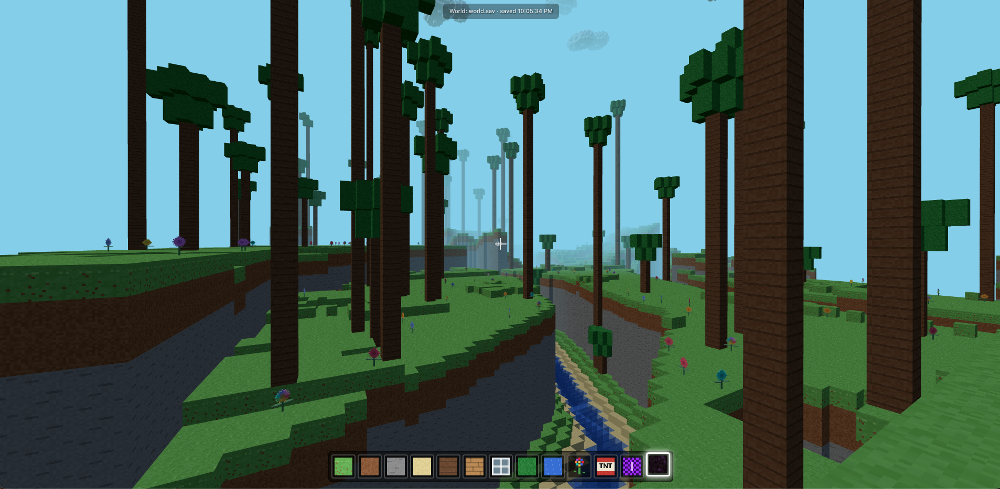

# Minicraft

A Minecraft-style game that runs in the browser.



## Run it

```
python3 server.py
```

Then open http://localhost:8383  
An internet connection is needed to load Three.js from the CDN.

## Core features

- **Procedural worlds**:
  - **Overworld**: hills, rivers, galleries and clouds
  - **The Nether**: lakes and volcanos errupting blue lava
  - **The End**: a platform with Ender Dragon and Endermen
- **Portals**: travel between dimensions
- **Blocks editing**: place, chain and break blocks with infinite reach
- **Grappling hook**: fly through worlds in one click
- **TNT**: bomb stuff and kill the Ender Dragon
- **Autosave**: don't loose your crafted worlds
